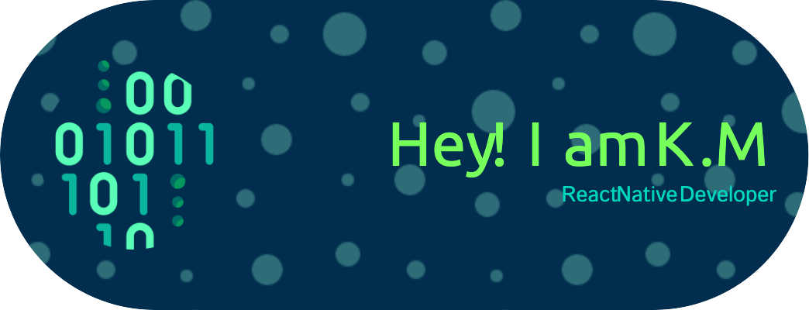

# 

- 👀 I’m interested in learning and solving problem, and creating mobile apps
- 🌱 I’m currently learning Flutter and React-Native
- 💞️ I’m looking to collaborate on cross-platform mobile apps
- 📫 How to reach me? Here at github

<!---
kam89/kam89 is a ✨ special ✨ repository because its `README.md` (this file) appears on your GitHub profile.
You can click the Preview link to take a look at your changes.
--->

## GitHub Stats

## GitHub Trends

